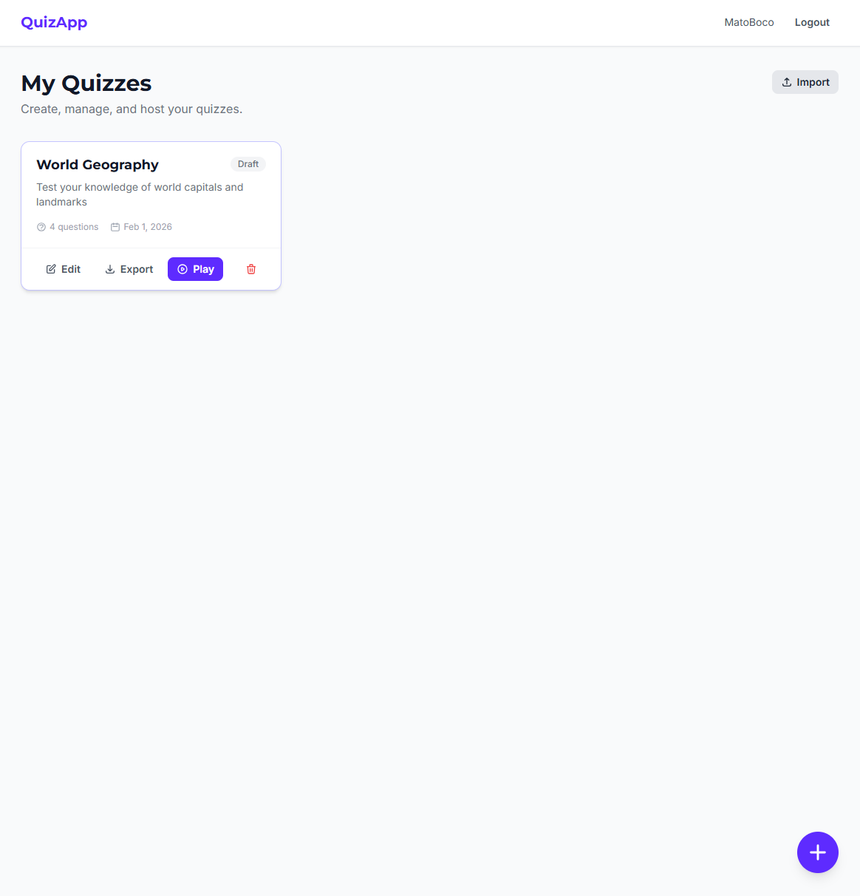
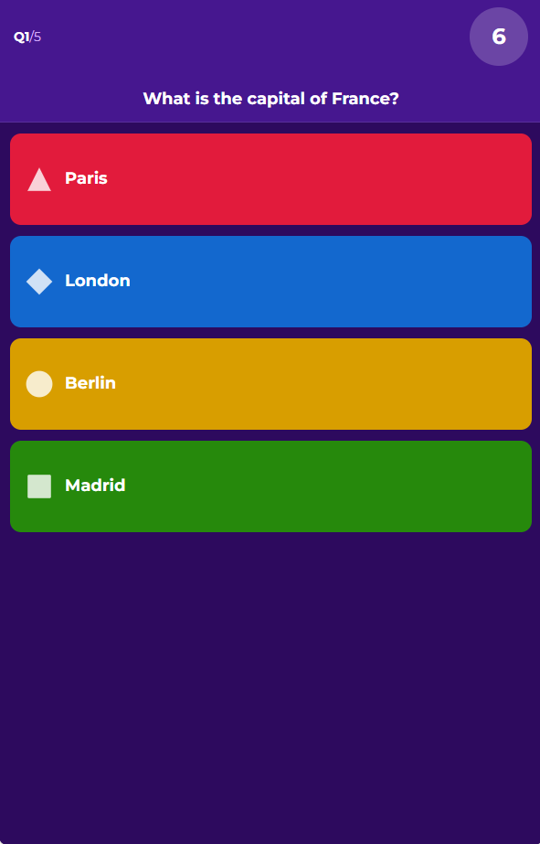

# QuizApp

Real-time multiplayer quiz game. Host creates quizzes, players join via PIN and compete for the highest score.

## Screenshots

| Quiz Dashboard | Player — answering on mobile |
|:---:|:---:|
|  |  |

See [all screenshots](docs/SCREENSHOTS.md) for a complete walkthrough of every screen.

## Features

### Quiz Management (Host)
- Create, edit and delete quizzes with multiple questions
- **5 question types**:
  - **Multiple Choice** - 2-4 answers, one correct
  - **True / False** - two fixed options
  - **Multi Select** - 2-8 answers, multiple correct (with optional partial credit)
  - **Ordering** - 2-8 items, players arrange in the correct order (partial credit)
  - **Number Guess** - player types a number; scored by distance from the correct answer within a tolerance range
- Configurable time limit per question (5-120 seconds)
- Optional description/hint text per question (shown to players below question)
- Optional image URL for questions
- 8 distinct answer colors and shapes for multi-select/ordering questions
- **Public / Private** quiz visibility — public quizzes are visible to all users, private quizzes are only visible to the owner
- **Quiz duplication** — duplicate your own or any public quiz to create an editable copy
- **Edit lock** — quizzes that have been played at least once become read-only; duplicate to make changes
- **Public quiz browser** — "Public Quizzes" tab on the dashboard shows all public quizzes from other users with View, Duplicate, and Export actions
- **Export / Import** quizzes as plain-text `.quiz.txt` files — human-readable, editable in any text editor, round-trip safe

### Real-time Gameplay
- Host generates a unique 6-digit PIN for each game session
- Players join with PIN + nickname (no registration required)
- QR code on lobby screen for quick join
- Live player list with connection status
- Automatic game flow: question → answers → results → leaderboard → next question
- Host can kick players from the lobby
- **Remote Display** — open `/display` on a projector, enter the game PIN, and it mirrors the host screen (lobby, questions, results, leaderboard) in read-only mode; multiple displays supported simultaneously
- **Share QR code on final results** — automatically generated QR code on both host and display screens links to detailed game results so players can scan and review their performance

### Scoring System
- **Base points**: 1000 per correct answer (scaled by correctness ratio for partial credit)
- **Time bonus**: up to 500 points for fast answers
- **Streak multiplier**: increases by 0.1x for each consecutive fully correct answer (max 2x)
- Incorrect answers, partial answers, or not answering in time all reset streak to 0
- **Multi Select partial credit**: `(correct selected - incorrect selected) / total correct` (min 0)
- **Ordering partial credit**: `items in correct position / total items`
- **Number Guess scoring**:
  - Linear scoring based on distance: `base_points * (1 - distance / tolerance)`
  - **Exact answer bonus**: +50% base points (e.g. 1000 base → 1500 total)
  - **No time bonus** — time is measured but does not affect score
  - **Streak**: continues if answer is within tolerance, resets if outside; streak multiplier is not applied to score
  - At or beyond tolerance boundary → 0 points
- Individual score breakdown after each question

### Admin Panel
- First registered user is automatically promoted to **superadmin**
- **Role-based access control** with three roles: `user`, `admin`, `superadmin`
- Admin dashboard with platform statistics (total users, quizzes, games, activity)
- User management: activate/deactivate accounts, reset passwords, change emails
- Superadmins can assign roles and delete users
- Accessible via "Admin" link in the header (admin/superadmin only)

### Game History & Statistics
- **Per-quiz history** — list of all finished games with player counts and timestamps
- **Game detail view** — final leaderboard, per-player stats (correct answers, avg response time)
- **Question-level analytics** — answer distribution chart for each question
- **Ranking progression** — line chart showing how player positions evolved question by question
- **Shareable results** — generate a public link so participants can review their game without logging in
- "History" button on each quiz card, "View Details" button on final results screen

### Reconnection
- Players and hosts can reconnect after page refresh or network drop
- JWT-based session recovery
- Automatic state sync on reconnect

### Quiz Export / Import

Export any quiz from the dashboard as a `.quiz.txt` file and import it back (or share it with others). The format is plain text, editable in any text editor:

```
# World Geography
> Test your knowledge of world capitals and landmarks

## What is the capital of France?
>> Hint: It's known as the City of Light
type: multiple-choice
* Paris
- London
- Berlin
- Madrid

## The Great Wall is in China
type: true-false
* True
- False

## Rank planets by distance from the Sun
type: ordering
time: 30
points: 2000
1. Mercury
2. Venus
3. Earth
4. Mars

## Select all prime numbers
type: multi-select
requireAll: true
* 2
* 3
- 4
* 5
- 6

## How many bones does an adult human have?
>> Closer guess = more points
type: number-guess
time: 30
answer: 206
tolerance: 50
```

Format rules:
- `# Title` and optional `> Description` at the top
- `## Question text` starts each question
- `>> Hint text` optional description/hint shown to players
- `type:` is required (`multiple-choice`, `true-false`, `multi-select`, `ordering`, `number-guess`)
- `time:` and `points:` are optional (defaults: 20s, 1000pts)
- `* answer` = correct, `- answer` = wrong, `1. answer` = ordering position
- `answer:` and `tolerance:` are used for `number-guess` (no `*`/`-` answer lines)

## Game Flow

```
Lobby → Get Ready (3s) → Question (timer) → Time's Up (1.5s)
  → Answers (3s) → Results (5s) → Leaderboard (5s) → Next Question...
  → Final Results (after last question)
```

All transitions are automatic with status guards - host can also advance manually via on-screen controls.

## Quick Start

```bash
docker compose up -d --build
```

Open `http://localhost` (app), `http://localhost:8025` (MailPit email UI), and `http://localhost:8080` (Adminer DB UI — server: `postgres`, user: `quizapp`, password: `quizapp-secret`).

See [Development Guide](docs/DEVELOPMENT.md) for local setup, environment variables, and test credentials.

## Docs

- [Tech Stack & Architecture](docs/TECH_STACK.md) — technologies, database, project structure
- [Development Guide](docs/DEVELOPMENT.md) — local setup, Docker, environment variables

## TODO

- [ ] Image upload for questions (currently URL only)
- [ ] Sound effects and music
- [x] Number guess question type (numeric input with tolerance-based scoring)
- [ ] Open-ended question type (free text)
- [ ] Team mode
- [x] Quiz import/export (`.quiz.txt` plain-text format)
- [x] Quiz duplication
- [x] Post-game statistics and analytics for host
- [x] Admin panel with user/role management
- [ ] Password reset / forgot password (self-service)
- [ ] Rate limiting on API endpoints
- [ ] Unit and integration tests
- [x] Docker setup for deployment
- [x] Email verification at registration
- [x] PostgreSQL support (dual SQLite/PostgreSQL via Kysely)
- [ ] Production build and deployment guide
- [ ] Configurable auto-advance timing per quiz
- [ ] Player avatars / custom colors
- [x] Remote display screen for projectors (`/display`)
- [ ] Lobby chat
