# Screenshots

Complete visual walkthrough of QuizBonk — from login to gameplay.

## Authentication

| Login | Registration |
|:---:|:---:|
| 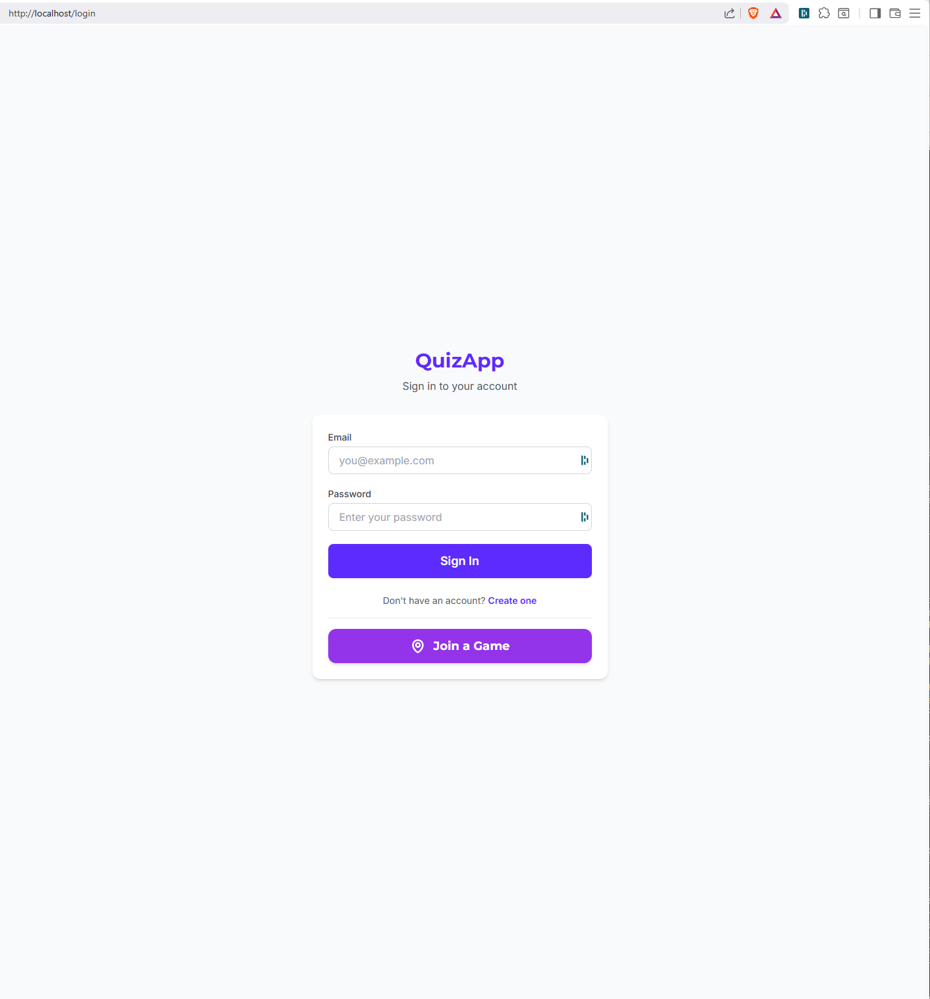 | 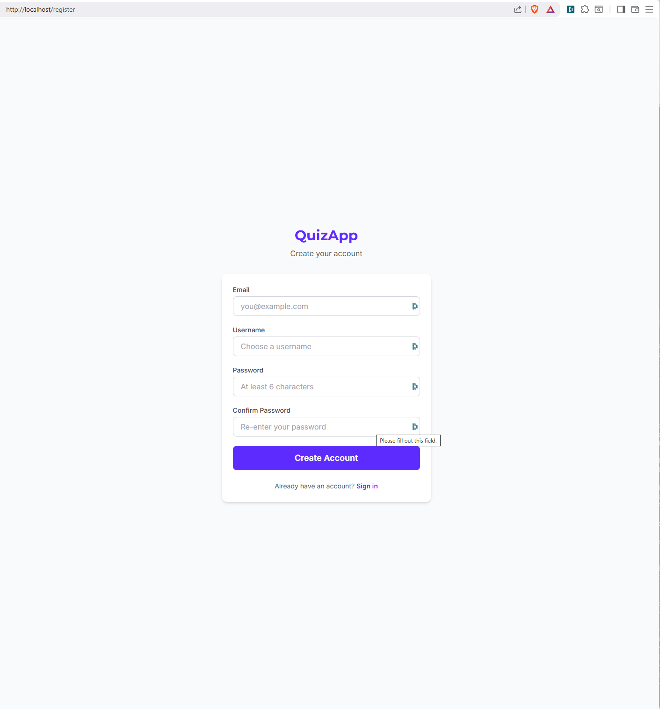 |

- **Login** — sign in with email and password; "Join a Game" button for players who don't need an account
- **Registration** — create a new account with email, username and password; email verification required before login

## Quiz Dashboard

| My Quizzes | Public Quizzes |
|:---:|:---:|
|  | 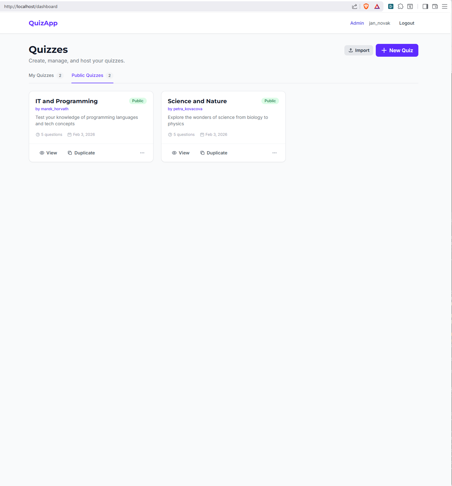 |

- **My Quizzes** — user's own quizzes with Edit, History, Play and more actions; Import button and New Quiz for creating quizzes
- **Public Quizzes** — browse public quizzes from other users with View, Duplicate and Export actions

## Admin Panel

| Admin Dashboard | User Management |
|:---:|:---:|
| 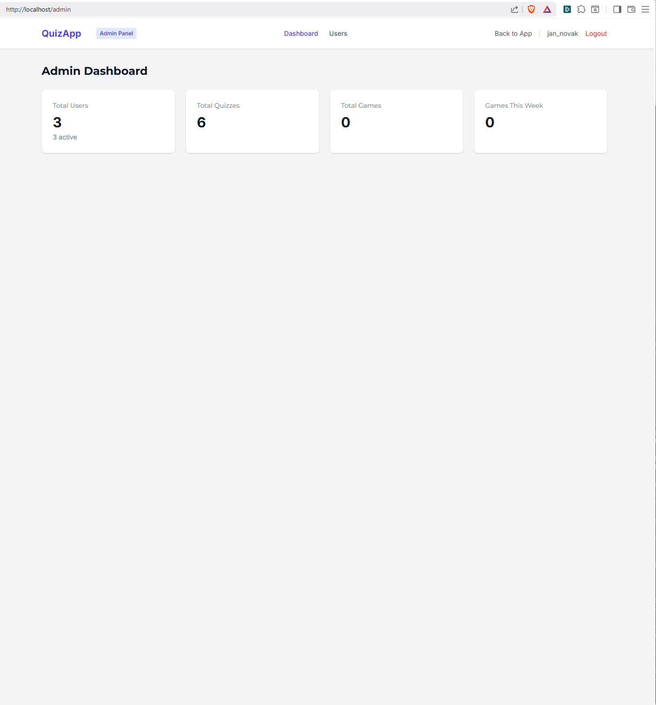 | 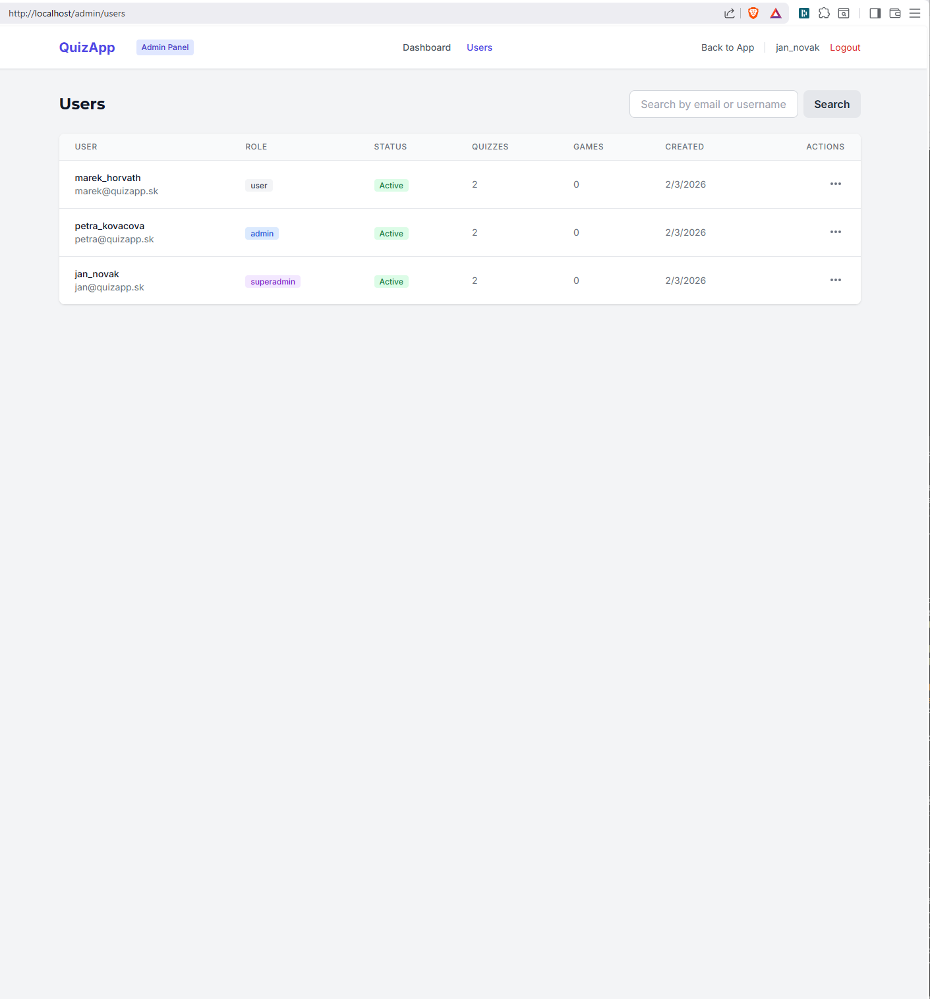 |

- **Admin Dashboard** — platform statistics: total users, quizzes, games played, and weekly activity
- **User Management** — user table with roles (user, admin, superadmin), status, quiz/game counts, and actions (edit, deactivate, delete)

## Joining a Game

| Player PIN Entry | Remote Display PIN Entry |
|:---:|:---:|
| 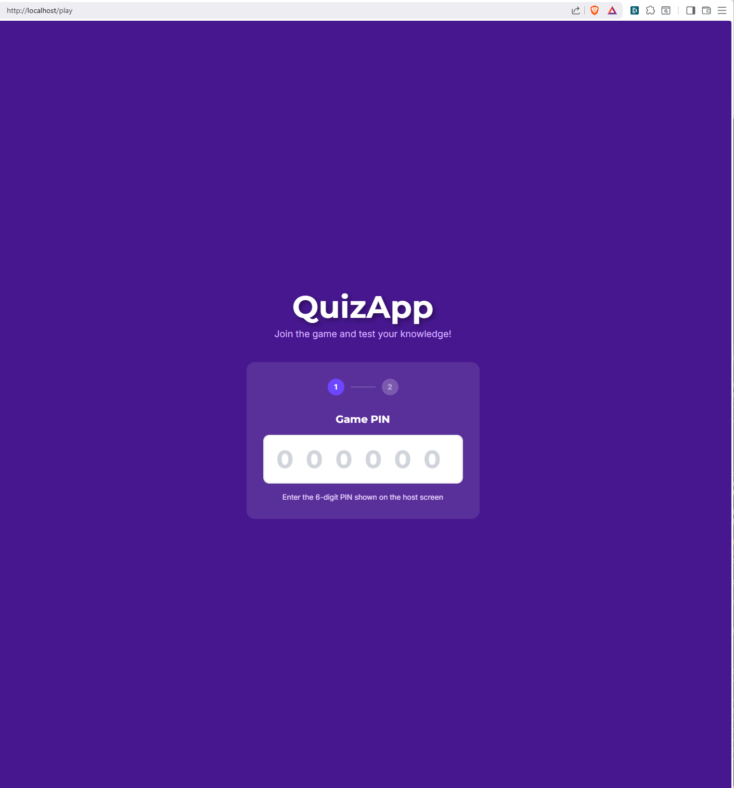 | 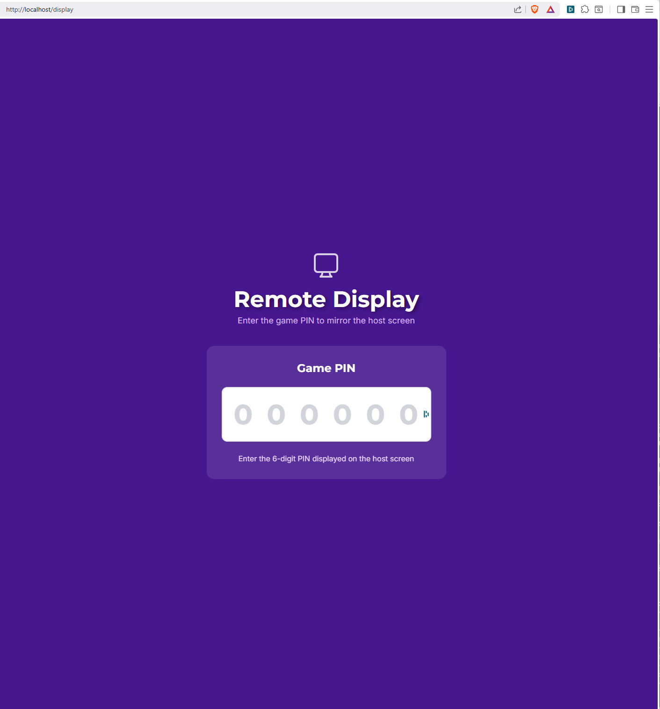 |

- **Player PIN Entry** (`/play`) — players enter the 6-digit game PIN to join; no registration required
- **Remote Display** (`/display`) — projector/external screen enters the PIN to mirror the host view in read-only mode

## Game Lobby

| Host Lobby (waiting) | Host Lobby (player joined) |
|:---:|:---:|
| 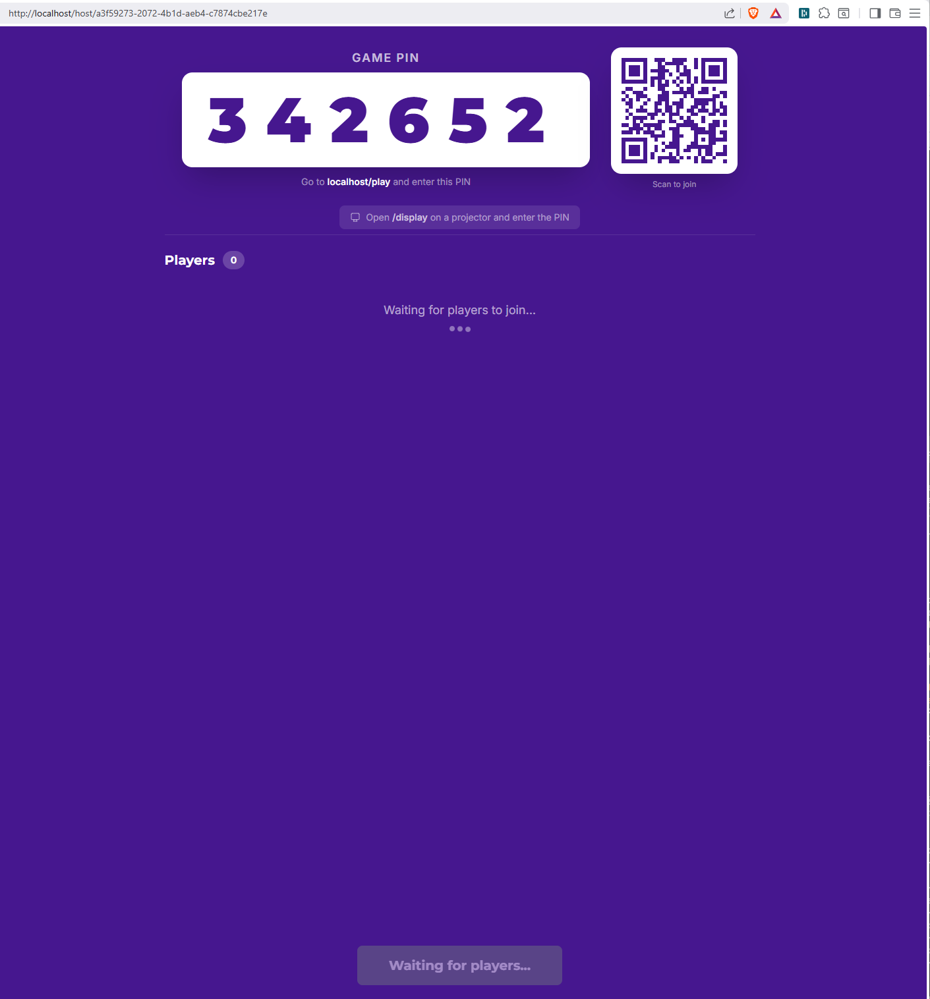 | 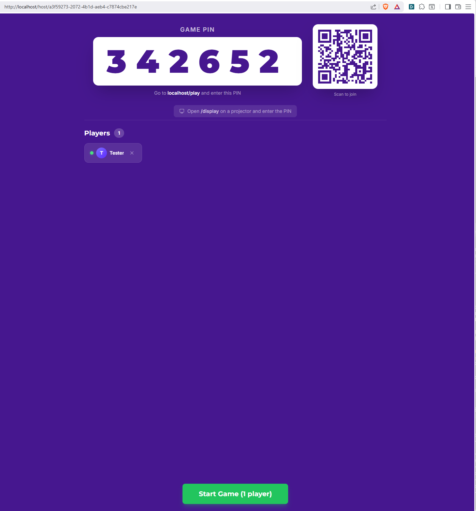 |

- **Host Lobby (waiting)** — displays the game PIN, QR code for quick join, remote display hint, and player count; Start button is disabled until at least one player joins
- **Host Lobby (player joined)** — player "Tester" has joined; Start Game button becomes active

| Player Lobby (mobile) |
|:---:|
| 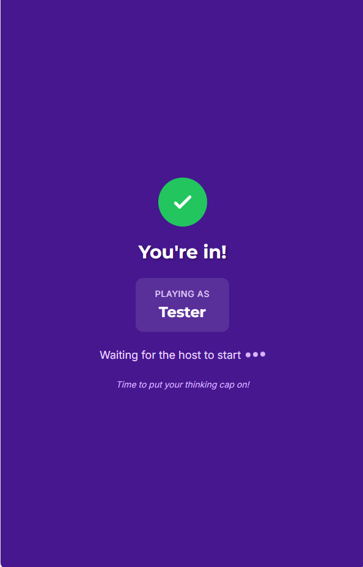 |

- **Player Lobby** — mobile view after joining; shows "You're in!" confirmation with nickname and waiting indicator

## Live Gameplay

| Host Question View | Player Question View (mobile) |
|:---:|:---:|
|  |  |

- **Host Question View** — displays question text, description hint, colored answer options, question counter (1 of 5), type badge (Multiple Choice), countdown timer (19s), and "End Question Early" button
- **Player Question View** — mobile layout with large tap-friendly answer buttons, same color coding as host view, compact timer and question counter

## Leaderboard

| Host Leaderboard |
|:---:|
| 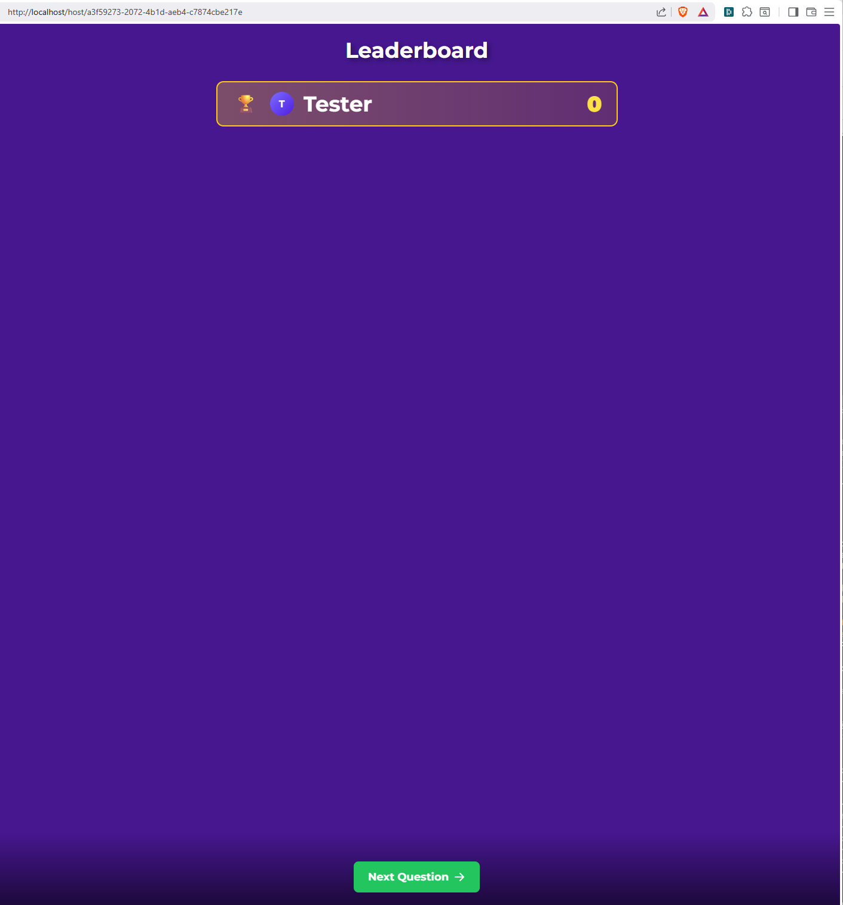 |

- **Leaderboard** — shown after each question; displays player rankings with scores and "Next Question" button to advance
